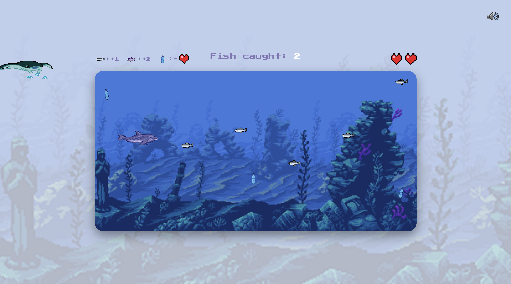

# Dolphin Dash

A browser-based arcade game built with plain HTML, CSS, and JavaScript. Guide a dolphin through the ocean, collect fish, dodge pollution, and try to beat your high score — all while learning a bit about marine pollution along the way.

---

## Game Concept

You play as a dolphin swimming through the sea. Fish drift by from the right side of the screen, you have to catch them to score points. Plastic bottles (pollution) also drift by, if touch one you lose a life. Lose all your lives and it's game over, where you're shown your final score and a short video about ocean plastic pollution before you restart.

### How to Play
- Click **START GAME** on the start screen.
- Use **Arrow Up** / **Arrow Down** to move the dolphin vertically.
- Catch fish to score points:
  - Regular fish = **+1**
  - Fast fish (appears once your score reaches 5) = **+2**
- Avoid plastic bottles: each one costs you a life.
- You start with **2 lives**. Lose them all and the game ends.
- On the Game Over screen, click **RESTART** to play again.
- Use the speaker icon (top-right) to mute/unmute sound and music at any time.

---

## MVP Goals

- Create a start screen
- Create a playable game area
- Allow the dolphin to move up and down
- Spawn fish that increase the score
- Spawn pollution (initially fishnet but was too complicated to animate) that removes lives.
- Display the current score
- Display remaining lives
- Show a Game Over screen
- Allow the player to restart without refreshing the page

## Extra Features Completed

- Two fish types with different speeds and point values
- A scrolling background for a sense of motion
- Added responsive sizing using clamp() and aspect-ratio.
- A decorative, non-interactive manta ray that periodically drifts across the screen
- Lives displayed as heart icons
- Sound effects (splash, dolphin call, happy dolphin) and background music, with a mute/unmute toggle
- Pollution bottles that rotate and bob using a sine-wave animation for a "drifting" feel
- An embedded educational video about marine pollution on the Game Over screen


---

## Links

- **[Deployed game](https://pannacodes.github.io/Dolphin-mini-game/)**
- **[GitHub repository](https://github.com/Pannacodes/Dolphin-mini-game)**
- **Project board (GitHub Issues / Projects)** 
- **Presentation slides** 

---

## Screenshot


```md

```

---

## Project Structure

```
├── index.html
├── styles/
│   └── style.css
├── js/
│   ├── main.js        # game state, loop, spawning, collisions, event listeners
│   ├── player.js       # Dolphin class
│   ├── fish.js         # Fish class
│   ├── pollution.js    # Pollution class
│   └── manta.js         # Manta class (decorative)
├── images/
├── sounds/
└── README.md
```

---

## Built With

- HTML5
- CSS3 (custom properties, flexbox/grid, responsive units)
- Vanilla JavaScript (ES6 classes, DOM manipulation, `setInterval` game loop)
- No frameworks, no backend — runs entirely in the browser

---

## 🐞 Known Issues / Bugs
 
- **Obstacle changed mid-project:** originally planned fishnets as the obstacle, but swapped to pollution bottles because fishnets were too complex to implement in the time available
- **Class naming inconsistency:** class names weren't consistently capitalised (should follow PascalCase, e.g. `Dolphin`, `Fish`, not lowercase)
- **Minor typos** scattered through the code/comments
- **Video audio bug:** the Game Over pollution video's sound keeps playing in the background after leaving/restarting (only the `src` is reset, not fully stopped/paused before that)
- **Tab-switch bug (unresolved):** if the player switches browser tabs mid-game, entities accumulate on the right side of the screen — likely because `setInterval`-based movement keeps "firing" based on time elapsed while the tab is inactive/throttled, but the browser doesn't render in between, so objects appear to jump/pile up. Not fixed in this version

---

## 🔄 Retrospective


- **What worked well:**
- The overall game structure as it was similar to the code along

**What didn't go as planned:**
- Scope had to shrink mid-project (fishnets → pollution) once the original obstacle proved too complex to build in time
- Some code quality issues (naming, typos) crept in
- A background-tab bug around object movement was found but not resolved before submission
**What I'd change next time:**
- Set up a clearer design/plan before coding — e.g. a quick Figma mockup or wireframe — to have a stronger sense of direction from the start, rather than figuring out layout and features as I went
---

## AI Assistance Log
 
Used AI to:
- Explore possible game concepts
- Discuss ways of including an educational conservation message
- Brainstorm optional features that would fit the game's theme
- Learn JavaScript through asking questions
 
### Debugging
Used AI to help investigate:
- Collision issues
- Restart logic
- Sound continuing after restart
- GitHub Pages asset paths
- CSS layout issues
- Responsive sizing
- JavaScript errors shown in the browser console
- General code cleanup
 
### Asset Creation
Used AI image generation to create:
- Pixel-art sound icons
- Fishing net sprites
- Marine pollution sprites
- Small UI graphics

 
### Documentation
Used AI to:
- Improve comments
- Organize documentation
- Review code for readability
- Help prepare the README and presentation materials

**What AI did NOT do:** write the core game logic (collision detection, scoring, spawning, state management)


